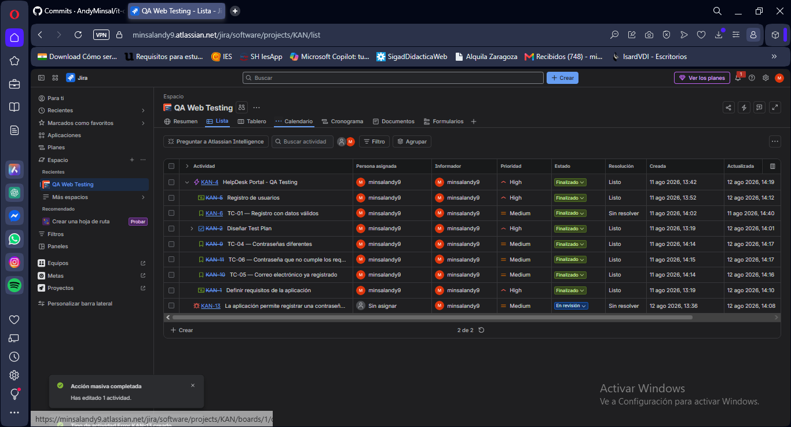
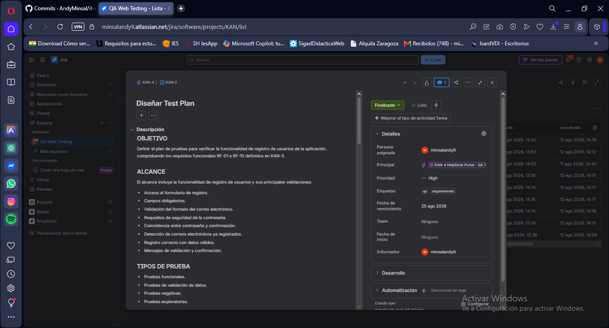
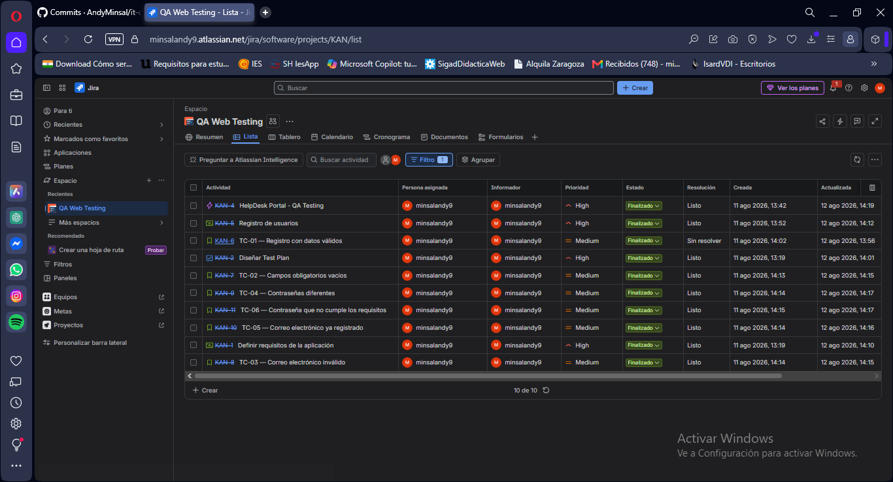
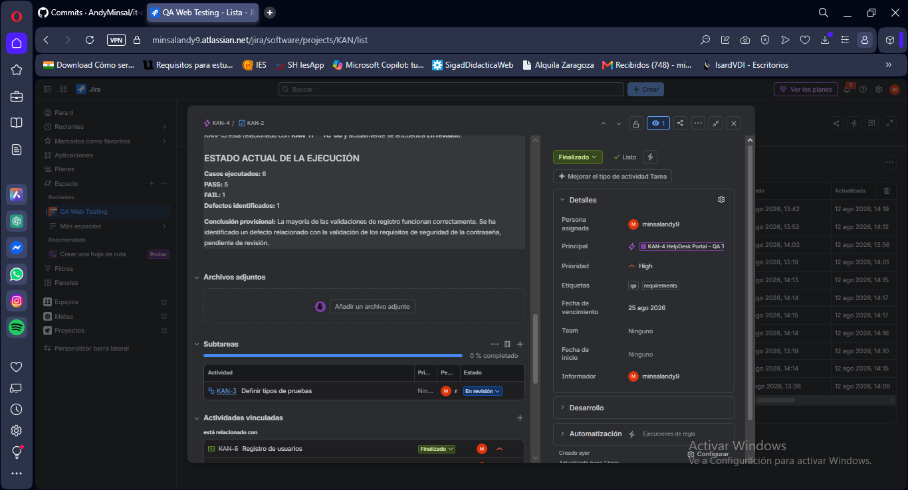
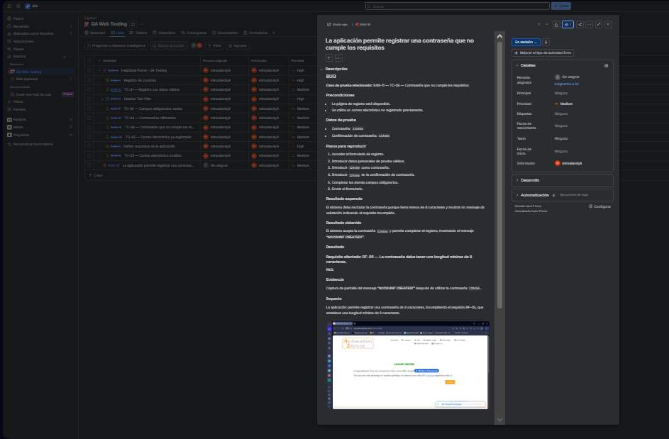

# QA Web Testing — HelpDesk Portal

Proyecto práctico de **QA Manual** realizado sobre una aplicación web de pruebas, utilizando Jira para la planificación, ejecución y seguimiento de casos de prueba y defectos.

## 🎯 Objetivo

Evaluar el funcionamiento del proceso de registro de usuarios de una aplicación web, verificando que los requisitos funcionales definidos se cumplen correctamente.

El proyecto incluye:

- Definición de requisitos.
- Diseño de un Test Plan.
- Creación de casos de prueba.
- Ejecución de pruebas funcionales.
- Registro y documentación de defectos.
- Seguimiento del estado de las pruebas.
- Gestión del ciclo de vida de un defecto.

## 🧪 Alcance de las pruebas

Las pruebas se centraron en el formulario de registro de usuarios.

Se comprobaron principalmente:

- Registro con datos válidos.
- Campos obligatorios.
- Formato del correo electrónico.
- Correos electrónicos duplicados.
- Contraseñas diferentes.
- Requisitos mínimos de contraseña.

## 📋 Casos de prueba

| ID | Caso de prueba | Resultado |
|---|---|---|
| TC-01 | Registro con datos válidos | PASS |
| TC-02 | Campos obligatorios vacíos | PASS |
| TC-03 | Correo electrónico inválido | PASS |
| TC-04 | Contraseñas diferentes | PASS |
| TC-05 | Correo electrónico ya registrado | PASS |
| TC-06 | Contraseña que no cumple los requisitos | FAIL |

## 📊 Resultados

**Casos ejecutados:** 6

- ✅ PASS: 5
- ❌ FAIL: 1
- 🐞 Defectos identificados: 1

### Resultado general

La mayoría de las validaciones del formulario funcionan correctamente.

Sin embargo, durante la ejecución del caso **TC-06** se identificó un defecto relacionado con la validación de la contraseña.

## 🐞 Defecto identificado

### La aplicación permite registrar una contraseña que no cumple los requisitos

**Caso relacionado:** TC-06 — Contraseña que no cumple los requisitos

**Datos utilizados:**

- Contraseña: `123456`
- Confirmación: `123456`

### Resultado esperado

La aplicación debería rechazar la contraseña cuando no cumple los requisitos mínimos de seguridad definidos y mostrar información sobre los requisitos incumplidos.

### Resultado obtenido

La aplicación acepta la contraseña y permite completar el registro mostrando:

**ACCOUNT CREATED!**

### Impacto

La aplicación permite registrar una contraseña de 6 caracteres, incumpliendo el requisito **RF-05**, que establece una longitud mínima de 8 caracteres.

### Gestión del defecto

El defecto fue registrado y documentado en Jira como **KAN-13**, relacionado con el caso de prueba **KAN-11 / TC-06**.

El defecto permanece **En revisión** para representar correctamente el estado de un defecto detectado durante el ciclo de pruebas.

## 🔄 Flujo de trabajo

El proyecto siguió un flujo básico de QA:

**Requisitos → Test Plan → Casos de prueba → Ejecución → PASS / FAIL → Registro del defecto → Seguimiento → Cierre del ciclo de pruebas**

## 🛠️ Herramientas utilizadas

- Jira
- Navegador web
- Aplicación web de pruebas
- GitHub
- Pruebas funcionales manuales

## 📸 Evidencias

### 1. Proyecto Jira

Vista general del proyecto y de las actividades utilizadas para gestionar el ciclo de pruebas.

### 2. Test Plan

Estructura y planificación del ciclo de pruebas.

### 3. Casos de prueba

Casos de prueba definidos para validar el proceso de registro.

### 4. Ejecución de pruebas

Resultado de la ejecución: **5 casos PASS y 1 caso FAIL**.

### 5. Defecto KAN-13

Defecto identificado durante la ejecución del caso TC-06 y documentado en Jira.

## 📚 Conocimientos demostrados

Este proyecto demuestra experiencia práctica en:

- QA Manual.
- Diseño de casos de prueba.
- Pruebas funcionales.
- Validación de requisitos.
- Identificación de defectos.
- Reproducción de errores.
- Documentación de bugs.
- Gestión de incidencias en Jira.
- Seguimiento del ciclo de pruebas.
- Elaboración de evidencias de testing.

## 🎓 Conclusión

El proyecto permitió realizar un ciclo completo de pruebas funcionales sobre una aplicación web, desde la definición de requisitos y diseño de casos de prueba hasta la ejecución, identificación y documentación de un defecto.

El resultado final fue de **5 casos PASS y 1 caso FAIL**, con un defecto correctamente documentado y relacionado con el caso de prueba correspondiente.
